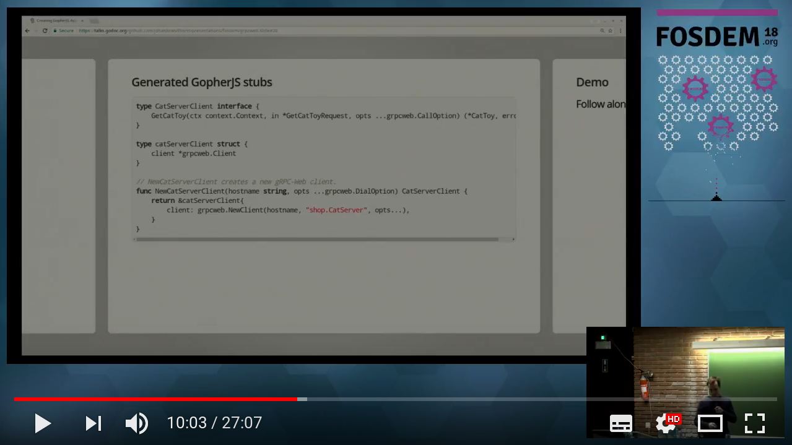

# GopherJS gRPC-Web Boilerplate


A minimal repo containing all the boilerplate for getting started with
GopherJS using gRPC-Web. Clone and use as a base for your own
experimentation with GopherJS and gRPC-Web!

It comes complete with a Go generate template for statically serving
your generated JS code from the backend server.

## Video example
A recording of my presentation at the Go Devroom at FOSDEM 2018, in which
I clone this repo I perform a small demo of its use.

[](https://youtu.be/R2HaxH7Et64?t=603 "Video example")

## Requirements

Generating the files requires the `protoc` protobuf compiler.
Please install it according to the
[installation instructions](https://github.com/google/protobuf#protocol-compiler-installation)
for your specific platform.

## Getting started

After cloning the repo, there are a couple of initial steps;

1. Install the generate dependencies with `make install`.
    This will install `protoc-gen-go` and `protoc-gen-gopherjs`, which
    are necessary for us to generate the Go and GopherJS files.
1. Generate a self-signed certificate with `make generate_cert`.
    This is necessary for us to serve the GopherJS files over HTTPS.
    When opening your browser it will not trust the certificate, so
    if you want to, you can add the generate certificate to your trust store first.
1. If you forked this repo, or cloned it into a different directory from the github structure,
    you will need to correct the import paths. Here's a nice `find` one-liner for accomplishing this
    (replace `yourscmprovider.com/youruser/yourrepo` with your cloned repo path):
    ```bash
    $ find . -path ./vendor -prune -o -type f \( -name '*.go' -o -name '*.proto' \) -exec sed -i -e "s;github.com/johanbrandhorst/grpcweb-boilerplate;yourscmprovider.com/youruser/yourrepo;g" {} +
    ```
1. Finally, generate the JS files with `make generate`.
    If you encounter an error here, make sure you've installed
    `protoc` and it is accessible in your `$PATH`, and make sure
    you've performed step 1.

Now you can run the web server with `make serve`.

## Making it your own

The next step is to define the interface you want to expose in
`proto/web.proto`. See https://developers.google.com/protocol-buffers/
tutorials and guides on writing protofiles.

Once that is done, regenerate the backend and frontend files using
`make generate`. This will mean you'll need to implement any functions in
`backend/backend.go`, or else the build will fail since your struct won't
be implementing the interface defined by the generated file in `proto/server/`.

It also means you can start using the functions exposed by the server
in your frontend client in `frontend/frontend.go`.

Every time you make changes to any files under `frontend/` you'll
need to regenerate the JS files using `make generate`.

This should hopefully be
all you need to get started playing around with the GopherJS gRPC-Web
bindings!

## What this repo isn't

This repo is _not_ a general example of how to use the GopherJS gRPC-Web bindings.
For such an example, please see https://github.com/johanbrandhorst/grpcweb-example
and https://grpcweb.jbrandhorst.com.

This repo is also not a particularly good example of how to write an app with
GopherJS. Please explore the tutorials and wiki pages on
https://github.com/gopherjs/gopherjs and check out frameworks such as
https://myitcv.io/react and https://github.com/gopherjs/vecty for
a better way to write GopherJS apps.
